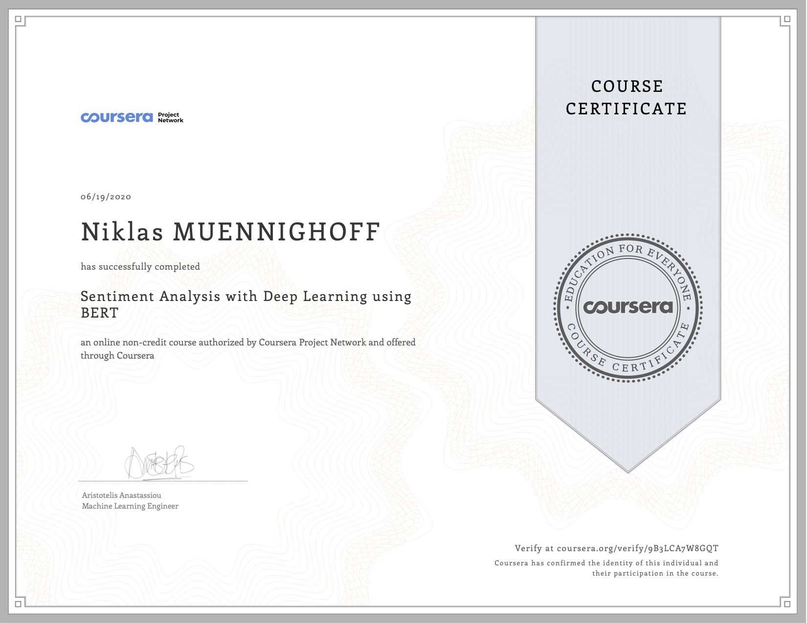

# BERTSentimentTW
Using BERT to classify sentiments of Tweets form Twitter

Simple notebook using the BERTSequenceClassifier provided by hugging face, following a coursera tutorial.

https://www.coursera.org/learn/sentiment-analysis-bert/

Pretrained model: 
https://drive.google.com/file/d/1StVw0jsBcz_9w_N_x9LaWC5coWe-GcFN/view?usp=sharing 

